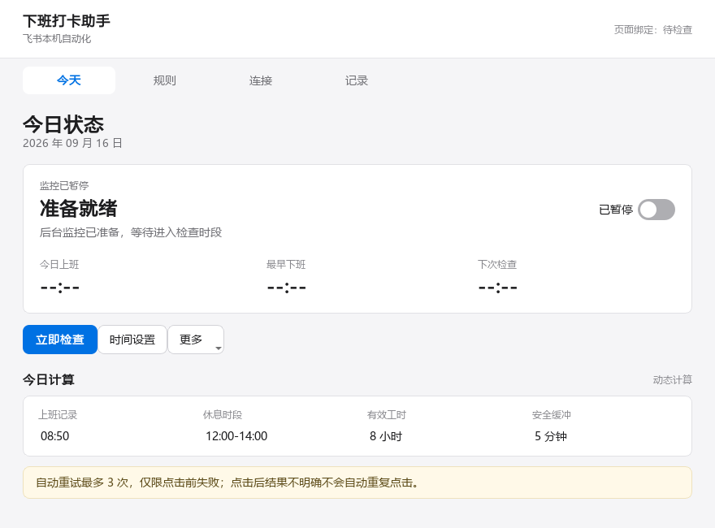
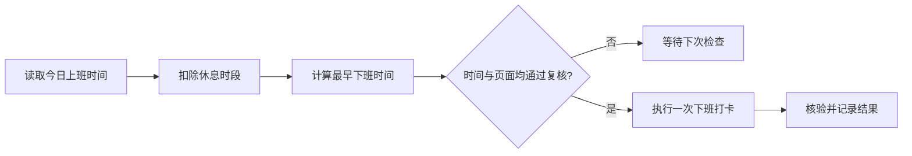

<div align="center">
  
  <h1>飞书动态下班打卡助手</h1>
  <p>读取实际上班时间，自动计算最早下班时间，并在 Windows 飞书桌面端完成安全打卡。</p>

  <p>
    <a href="https://github.com/Liu8Can/feishu-auto-task/releases/latest"></a>
    <a href="https://github.com/Liu8Can/feishu-auto-task/releases"></a>
    
    
    <a href="https://linux.do/"></a>
  </p>

  <p>
    <a href="https://github.com/Liu8Can/feishu-auto-task/releases/latest"><strong>下载正式版</strong></a>
    · <a href="#首次设置"><strong>首次设置</strong></a>
    · <a href="#快速开始"><strong>试用教程</strong></a>
    · <a href="https://github.com/Liu8Can/feishu-auto-task/issues"><strong>问题反馈</strong></a>
  </p>
</div>

---

读取当天实际上班时间，自动跳过午休并计算最早下班时间；到点后重新确认页面和按钮，再完成一次下班打卡。

> [!IMPORTANT]
> 当前稳定版 `v1.0.0` 只自动处理**下班打卡**。自动上班打卡正在开发，计划随 `v1.1.0` 发布；当前尚未支持普通用户试用。

## 界面预览

<p align="center">
  
</p>

## 它会做什么

| 能力 | 当前行为 |
| --- | --- |
| 自动进入假勤 | 启动飞书，并从左侧导航栏打开已固定的“假勤” |
| 动态计算下班时间 | 读取实际上班时间，扣除休息时段，再加入有效工时和安全缓冲 |
| 固定时间模式 | 允许设置固定上下班时间；实际上班较晚时自动顺延 |
| 后台运行 | 登录 Windows 后启动，关闭或最小化窗口时进入系统托盘 |
| 有限重试 | 仅在点击前失败时按设置重试；点击结果不明确时停止自动操作 |
| 可见诊断 | 显示绑定、页面识别、计算结果、运行记录和失败原因 |



## 开始之前

> [!WARNING]
> **请先把“假勤”固定到飞书左侧导航栏。** 助手依靠这个稳定入口自动打开考勤页面。没有固定时，飞书虽然可以正常启动，但页面绑定和后台自动打卡会失败。

完成标准：飞书左侧始终能看到“假勤”，点击后可直接进入今天的考勤页面。

此外还需要满足：

| 项目 | 要求 |
| --- | --- |
| 系统 | Windows 10/11，64 位 |
| 飞书 | 已安装并登录中文桌面端 |
| 桌面状态 | 到达打卡时间时保持开机、唤醒且已解锁 |
| 页面状态 | “假勤”已固定，今天的考勤页面可正常打开 |

本工具不能远程开机，也不能绕过 Windows 锁屏。睡眠或锁屏期间不会尝试点击；恢复并解锁后，如果仍在允许检查时段内才会继续复核，超过时段只记录错过，不会补点。

## 快速开始

1. 打开 [v1.0.0 发布页](https://github.com/Liu8Can/feishu-auto-task/releases/tag/v1.0.0)，下载页面中与版本号一致的 Windows 压缩包。
2. 解压完整压缩包，双击 `FeishuClockoutAssistant.exe`。
3. 在飞书中把“假勤”固定到左侧导航栏，并打开今天的考勤页面。
4. 在助手的“连接”页依次点击“打开飞书假勤”和“重新绑定页面”。
5. 点击“运行诊断”，确认“今天假勤页已确认”和“页面绑定有效”。
6. 回到“今天”页核对上班时间与预计下班时间，保持助手在系统托盘运行。

这是未签名的个人项目，Windows 可能显示来源提示。请只从本仓库发布页下载，并核对发布页中的 SHA-256 校验值。

> [!TIP]
> 首次试用建议只做固定入口、打开页面、绑定、诊断和预计时间前的“立即检查”。这些操作只读取页面和计算时间；进入允许下班时段后，“立即检查”可能执行真实打卡，请确认准备好再点击。

## 首次设置

### 1. 固定假勤入口

打开飞书工作台找到“假勤”，选择“固定”“添加到导航”或“添加到常用”。不同飞书版本的文字可能不同，最终应在左侧导航栏直接看到“假勤”。

### 2. 完成页面绑定

进入助手“连接”页，按顺序执行：

1. 点击“打开飞书假勤”。
2. 确认飞书显示今天的考勤页面。
3. 点击“重新绑定页面”，等待明确的成功或失败提示。
4. 点击“运行诊断”，确认飞书窗口、今日假勤页和页面绑定均有效。

绑定只读取页面，不会点击打卡。正常情况下只需完成一次；飞书升级导致页面结构变化时再重新绑定。

### 3. 核对时间规则

默认按以下规则动态计算：

| 设置 | 默认值 |
| --- | --- |
| 有效工作时长 | 8 小时 |
| 休息时段 | 12:00–14:00，不计入工时 |
| 安全缓冲 | 5 分钟 |
| 点击前重试 | 最多 3 次，间隔 5 分钟 |

例如：当天 08:31 上班，午休 2 小时，有效工时 8 小时，再加 5 分钟安全缓冲，最早下班时间为 **18:36**。

也可以在“规则”页切换为固定上下班时间。固定模式下，如果实际上班晚于设定时间，预计下班时间会相应顺延。

### 4. 留在后台运行

最小化或关闭主窗口后，程序会进入右下角系统托盘。双击托盘图标可重新打开，右键菜单可暂停监控或退出。

“登录 Windows 后自动在后台运行”默认开启，可在“规则”页关闭。这里指用户登录 Windows 后启动，不代表电脑能从关机状态自行开机。

## 点击前的安全门槛

只有下面条件**全部满足**时，程序才会执行下班打卡：

- 今天属于已配置的工作日，当前时间位于检查时段内。
- 当前时间不早于计算出的最早下班时间。
- Windows 桌面已解锁且可以交互。
- 页面日期为今天，绑定信息与当前假勤页面一致。
- 页面中只有一个可见、可用的“下班打卡”按钮。
- 点击前连续两次页面快照一致。
- 当天尚未开始过打卡点击。

点击前失败可以有限重试；只要点击调用已经开始，即使最终结果无法确认，当天也不会自动重复点击。此时请以飞书中的最终考勤记录为准。

## 常见问题

<details>
<summary><strong>页面绑定一直没有结果怎么办？</strong></summary>

绑定过程会显示“正在绑定”、成功、失败或 30 秒超时。发生超时时，请确认飞书停留在今天的假勤页面，再退出并重新打开助手。

</details>

<details>
<summary><strong>为什么今日上班时间是空的？</strong></summary>

先确认飞书今天的假勤页面已经显示上班记录，再到助手“连接”页运行诊断或重新绑定。启动和绑定成功后，助手会自动读取今日时间。

</details>

<details>
<summary><strong>最小化后找不到窗口怎么办？</strong></summary>

点击任务栏右侧的上箭头，在系统托盘中找到助手图标并双击。图标是否直接显示在任务栏由 Windows 管理。

</details>

<details>
<summary><strong>锁屏、睡眠或关机后还能自动打卡吗？</strong></summary>

不能。桌面自动化要求 Windows 处于唤醒、解锁状态，程序也不能让已关机的电脑自行启动。

</details>

<details>
<summary><strong>飞书已成功，但助手显示结果不明确怎么办？</strong></summary>

程序不会自动重复点击。重新打开飞书假勤页面并点击“立即检查”，程序会继续进行只读核验。

</details>

## 数据与隐私

程序通过 `Windows UI Automation`（Windows 界面自动化）在本机读取和操作飞书桌面端，不接入飞书开放平台，也不上传考勤信息。配置、状态和日志保存在：

```text
%LOCALAPPDATA%\FeishuClockoutAssistant
```

日志不记录密码，但可能包含工作时间。公开反馈问题前，请先检查准备上传的日志或截图。

## 版本计划

| 版本 | 状态 | 内容 |
| --- | --- | --- |
| `v1.0.0` | 已发布 | 读取上班时间、计算最早下班时间、自动下班打卡 |
| `v1.1.0` | 开发中 | 可配置的自动上班打卡时段、独立防重、有限重试和结果核验 |

上班自动打卡同样受 Windows 桌面状态限制：电脑关机、睡眠、锁屏或尚未登录时无法操作飞书。功能完成验证后才会合并到稳定版。

## 开发与构建

从源码运行：

```bat
setup.bat
run_demo.bat
```

执行测试：

```bat
set PYTHONPATH=src
.venv\Scripts\python.exe -m pytest -q
```

构建免安装版本：

```bat
build_release.bat
```

| 组成 | 技术 |
| --- | --- |
| 桌面界面 | `PySide6`（Qt 桌面框架） |
| 飞书自动化 | `pywinauto`（Windows 界面自动化库） |
| 应用打包 | `PyInstaller`（Python 应用打包工具） |
| 本地能力 | 系统托盘、单实例唤回、登录自启动、本地状态持久化 |

自动化测试使用模拟页面，不连接或点击真实飞书。第三方依赖及许可证见 [THIRD_PARTY_NOTICES.md](THIRD_PARTY_NOTICES.md)。

## 社区与声明

本项目认可并链接 [LINUX DO](https://linux.do/) 社区，感谢社区为开源项目提供交流与推广空间。

本项目为非官方工具，与飞书及其关联公司无关。使用前请确认所在单位的考勤制度和信息安全要求。桌面页面结构、网络状态、系统锁屏和飞书版本变化都可能影响运行结果，请以飞书中的最终考勤记录为准。
